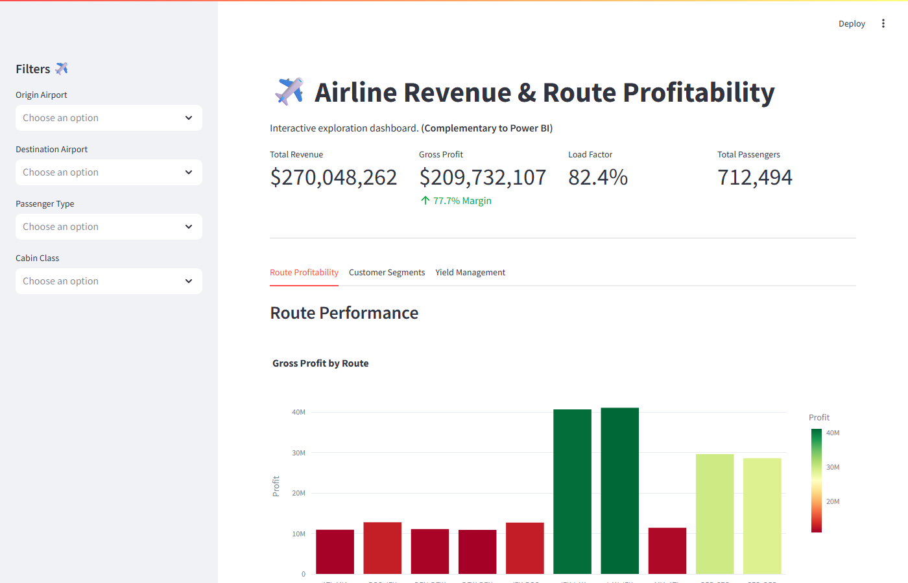
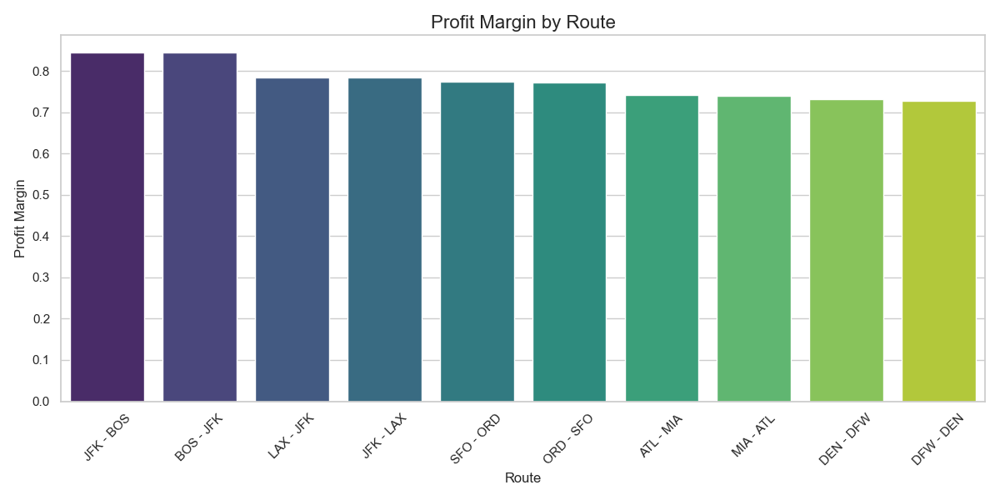
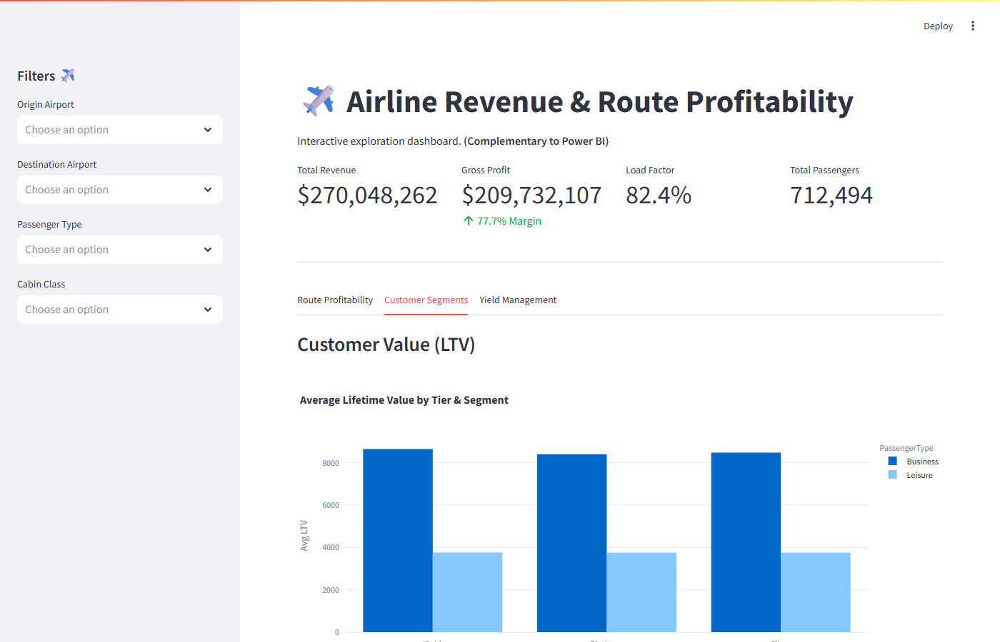
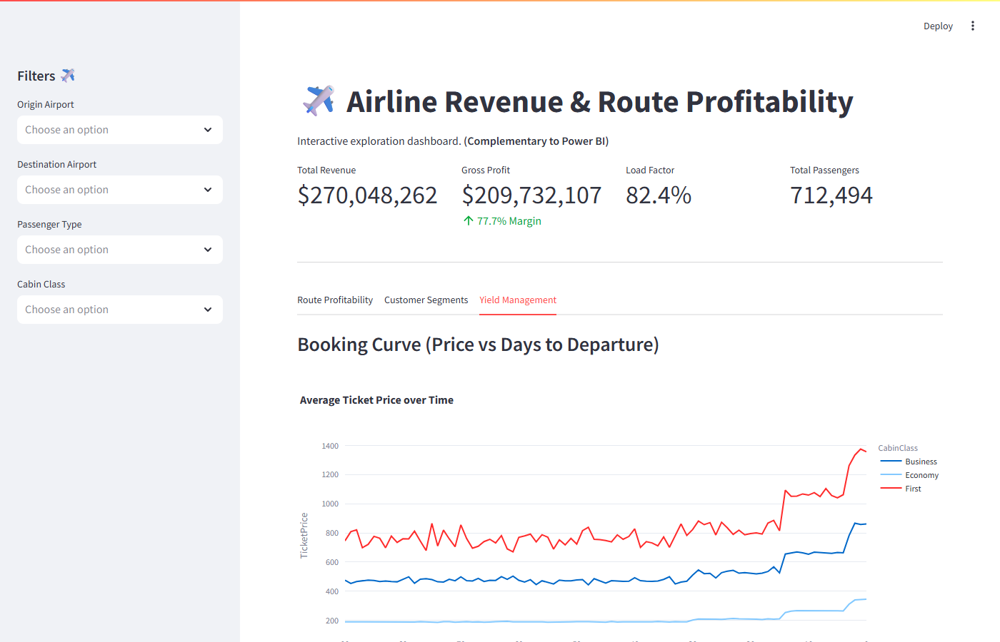

# ✈️ Airline Revenue & Route Profitability Analytics
**Business Strategy & Analytics Case Study | Bain BCN Intern Analyst Portfolio Project**



## 📌 Executive Summary
This project is an end-to-end business analytics solution simulating a commercial airline's operational and financial data (Jan–Dec 2025, 100k+ passenger bookings). The objective is to identify the core drivers of route profitability, optimize capacity allocation, and generate data-driven pricing strategies.

By bridging robust data engineering (MySQL) with advanced exploratory data analysis (Python/Pandas) and interactive visualizations (Streamlit/Power BI), this case study demonstrates the ability to transform raw data into highly actionable strategic recommendations.

---

## 💼 The Business Problem
Airlines operate in a high-revenue, low-margin environment where profitability hinges on optimizing fixed costs, maximizing capacity, and capturing yield from varied customer segments. 

**Key Objectives:**
1. **Route Profitability:** Which routes generate the highest margins, and which are bleeding cash due to fixed operational costs?
2. **Customer Valuation:** What is the Lifetime Value (LTV) of a Corporate/Business traveler vs. a Leisure traveler?
3. **Yield Management:** How effective is the current pricing algorithm at capturing inelastic demand as departure dates approach?

---

## 📊 Key Findings & Quantified Insights

### 1. Route Profitability & Cost Drivers
Long-haul transcontinental routes (e.g., LAX-JFK) generate the highest gross profit margins (averaging **~78%**). Despite higher fuel and crew costs, the elevated ticket prices and corporate demand easily absorb the variable expenses. Conversely, short-haul regional flights suffer from compressed margins as fixed airport costs consume a disproportionately large share of revenue.



### 2. Customer Segmentation & LTV
Business class passengers in the 'Gold' or 'Platinum' loyalty tiers are the most valuable asset. The average Lifetime Value (LTV) of a Gold Business passenger is **$9,125**, which is **2.3x higher** than a comparable Gold Leisure passenger ($3,969).



### 3. Yield Management (Price Elasticity)
The booking curves prove the efficacy of the airline’s yield management engine. Base ticket prices remain flat and affordable during the 30–90 day booking window to incentivize volume, but increase sharply for bookings made less than 14 days prior to departure, effectively capturing the inelastic demand of last-minute corporate travelers.



---

## 💡 Strategic Recommendations

Based on the quantified insights, I propose the following actionable initiatives:

1. **Re-Gauge Underperforming Routes:** Swap mainline narrow-body aircraft with smaller regional jets on short-haul routes where fixed airport costs are eroding margins. This reduces variable fuel/crew costs while maintaining the 83% load factor.
2. **Aggressive Corporate Retention:** Reroute marketing spend from general brand awareness into targeted B2B loyalty programs aimed at Gold and Platinum Business travelers (the $9,000+ LTV segment) to protect the core profitability engine.
3. **Dynamic Ancillary Pricing for Leisure:** Maintain highly competitive base fares for Economy/Leisure tickets made 60+ days in advance, but dynamically price ancillary products (bags, priority boarding) based on real-time flight demand to increase total revenue per available seat mile (TRASM).
4. **Yield Curve Steepening:** Increase pricing algorithm sensitivity at the 14-day and 7-day marks on heavily corporate routes to capture additional yield from highly inelastic last-minute business demand.

---

## 🛠️ Technical Architecture & Implementation

The project was executed in 5 distinct phases, ensuring clean engineering practices, reproducibility, and rigorous data quality.

1. **Data Generation & Engineering (`src/data_gen.py`):** Generated a mathematically consistent synthetic dataset of Airports, Routes, Flights, Customers, and Bookings.
2. **SQL Database Integration (`sql/`):** Loaded the data into a local MySQL instance. Utilized CTEs and window functions to prevent cost duplication and aggregate financials at the correct granularity.
3. **Python Exploratory Data Analysis (`notebooks/`):** Conducted rigorous EDA using `pandas`, `matplotlib`, and `seaborn` across 5 modular Jupyter notebooks.
4. **Data Visualization (`src/app.py`):** Developed a fully interactive Streamlit web dashboard powered by Plotly to allow stakeholders to filter and explore the data dynamically.
5. **Power BI Executive Blueprint (`reports/PowerBI_Dashboard_Guide.md`):** Engineered a flattened Star Schema dataset (`src/export_powerbi_data.py`) and provided a complete DAX and layout blueprint for an enterprise Power BI deployment.

---

## 🚀 How to Run & Reproduce

The repository is designed to be fully reproducible.

### 1. Setup Environment
```bash
git clone https://github.com/dinesh19-hub/Airline-Revenue-Route-Profitability-Analytics.git
cd Airline-Revenue-Route-Profitability-Analytics
python -m venv env
source env/bin/activate  # On Windows: env\Scripts\activate
pip install -r requirements.txt
```

### 2. Configure Database
Create a `.env` file in the root directory with your MySQL credentials:
```env
DB_HOST=localhost
DB_PORT=3306
DB_USER=root
DB_PASSWORD=yourpassword
DB_NAME=airline_analytics
```

### 3. Execute the Pipeline
```bash
# Generate the data and load it into MySQL
python src/data_gen.py
python src/db_utils.py

# Export the flattened dataset for the dashboards
python src/export_powerbi_data.py

# Launch the interactive Streamlit dashboard
streamlit run src/app.py
```
